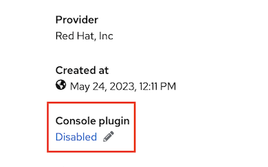
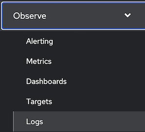
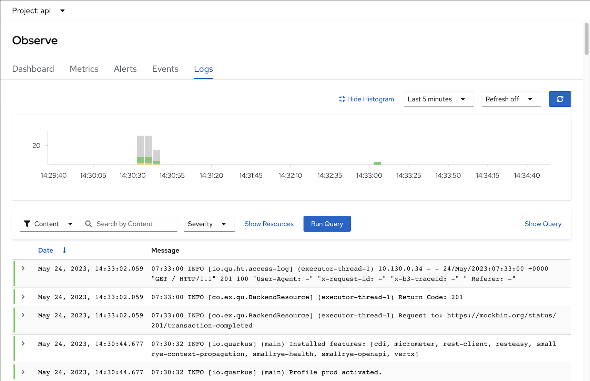
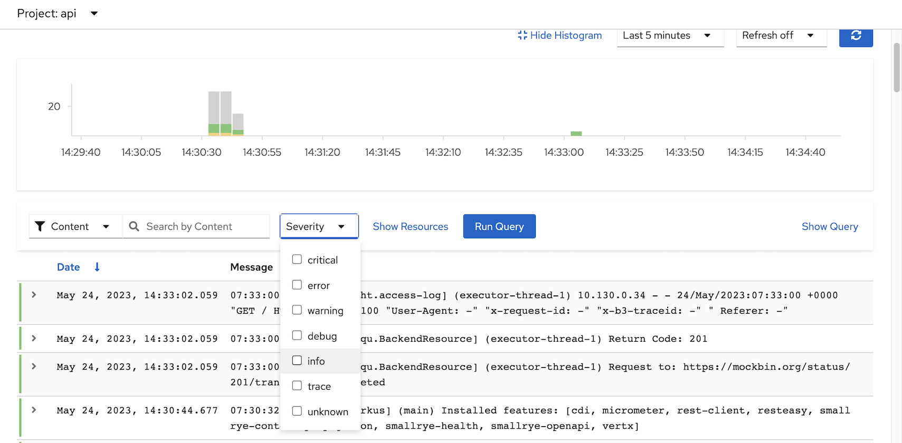
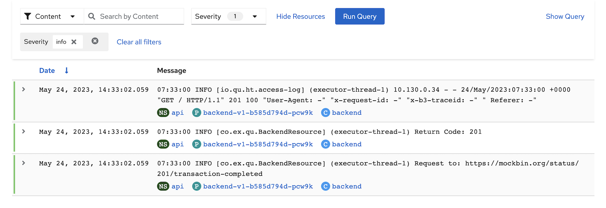
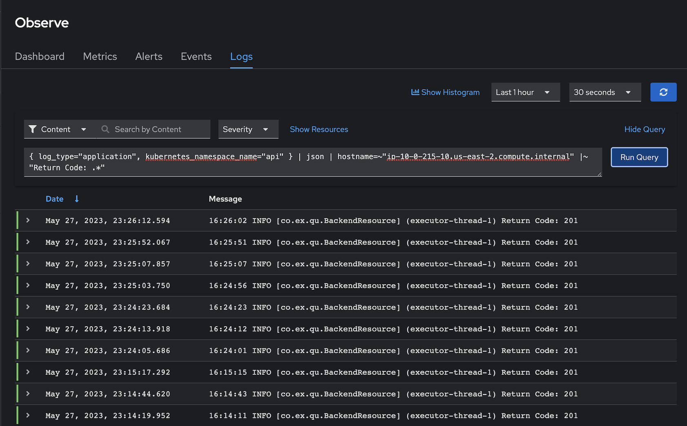

# Logging with Loki
- [Logging with Loki](#logging-with-loki)
  - [Install and Config](#install-and-config)
  - [Test with Sample Applications](#test-with-sample-applications)
  - [LogQL](#logql)
  - [Alert](#alert)

## Install and Config
- Install [Logging Operator](manifests/logging-operator.yaml) and [Loki Operator](manifests/loki-operator.yaml)
  
  ```bash
  oc create -f manifests/logging-operator.yaml
  oc create -f manifests/loki-operator.yaml
  sleep 30
  oc wait --for condition=established --timeout=180s \
  crd/lokistacks.loki.grafana.com \
  crd/clusterloggings.logging.openshift.io
  oc get csv -n openshift-logging
  ```

  Output

  ```bash
    NAME                     DISPLAY                     VERSION   REPLACES                 PHASE
    cluster-logging.v5.7.1   Red Hat OpenShift Logging   5.7.1     cluster-logging.v5.7.0   Succeeded
    loki-operator.v5.7.1     Loki Operator               5.7.1     loki-operator.v5.7.0     Succeeded
  ```

- Create Logging Instance
  - Prepare Object Storage configuration including S3 access Key ID, access Key Secret, Bucket Name, endpoint and Region
    - For demo purpose, If you have existing S3 bucket used by OpenShift Image Registry
      
      ```bash
        S3_BUCKET=$(oc get configs.imageregistry.operator.openshift.io/cluster -o jsonpath='{.spec.storage.s3.bucket}' -n openshift-image-registry)
        AWS_REGION=$(oc get configs.imageregistry.operator.openshift.io/cluster -o jsonpath='{.spec.storage.s3.region}' -n openshift-image-registry)
        AWS_ACCESS_KEY_ID=$(oc get secret image-registry-private-configuration -o jsonpath='{.data.credentials}' -n openshift-image-registry|base64 -d|grep aws_access_key_id|awk -F'=' '{print $2}'|sed 's/^[ ]*//')
        AWS_SECRET_ACCESS_KEY=$(oc get secret image-registry-private-configuration -o jsonpath='{.data.credentials}' -n openshift-image-registry|base64 -d|grep aws_secret_access_key|awk -F'=' '{print $2}'|sed 's/^[ ]*//')
       ```

  - Create [Logging and Loki Instances](manifests/logging-loki-instance.yaml)
    
    ```bash
    cat manifests/logging-loki-instance.yaml \
    |sed 's/S3_BUCKET/'$S3_BUCKET'/' \
    |sed 's/AWS_REGION/'$AWS_REGION'/' \
    |sed 's/AWS_ACCESS_KEY_ID/'$AWS_ACCESS_KEY_ID'/' \
    |sed 's|AWS_SECRET_ACCESS_KEY|'$AWS_SECRET_ACCESS_KEY'|' \
    |oc create -f -
    watch oc get po -n openshift-logging
    ```
    
    Output

    ```bash
    secret/logging-loki-s3 created
    lokistack.loki.grafana.com/logging-loki created
    clusterlogging.logging.openshift.io/instance created
    
    NAME                                          READY   STATUS    RESTARTS   AGE
    cluster-logging-operator-66d774b4d7-bfwvx     1/1     Running   0          29m
    collector-28gjt                               2/2     Running   0          41s
    collector-9jpj9                               2/2     Running   0          41s
    collector-bn22f                               2/2     Running   0          41s
    collector-zxn6x                               2/2     Running   0          41s
    logging-loki-compactor-0                      1/1     Running   0          38s
    logging-loki-distributor-759fdb8d45-gb67f     1/1     Running   0          38s
    logging-loki-gateway-b49f86589-f6gmc          2/2     Running   0          38s
    logging-loki-gateway-b49f86589-g8lgr          2/2     Running   0          38s
    logging-loki-index-gateway-0                  1/1     Running   0          38s
    ```

- Enable Console Plugin Operator
  - Navigate to Administrator->Operators->Installed Opertors->Red Hat OpenShift Logging then Enable Console Plugin on the right menu
  
    


  - Or using CLI
    
    ```bash
    oc patch console.operator cluster --type json -p '[{"op": "add", "path": "/spec/plugins/-", "value": "logging-view-plugin"}]'
    ```

- Restart console pod
    
  ```bash
  for pod in $(oc get po -l component=ui -n openshift-console --no-headers -o custom-columns='Name:.metadata.name,PHASE:.status.phase' |grep Running|awk '{print $1}')
  do
    oc delete po $pod -n openshift-console
  done
  ```

- Verify that Logs menu is avaiable under Observe menu
  
  


## Test with Sample Applications

- Deploy sample applications

  ```bash
  oc new-project ui
  oc new-project api
  oc create -f manifests/frontend.yaml -n ui
  oc create -f manifests/backend-v1.yaml -n api
  oc expose deployment/backend-v1 -n api
  oc set env deployment/frontend-v1 BACKEND_URL=http://backend-v1.api.svc:8080 -n ui
  oc set env deployment/frontend-v2 BACKEND_URL=http://backend-v1.api.svc:8080 -n ui
  oc set env deployment/backend-v1 APP_BACKEND=https://mockbin.org/status/201/transaction-completed -n api
  oc scale deployment/frontend-v1 --replicas=3 -n ui
  oc scale deployment/frontend-v2 --replicas=3 -n ui
  oc scale deployment/backend-v1 --replicas=6 -n api
  ```

- Test sample app
  
  ```bash
  FRONTEND_URL=$(oc get route/frontend -o jsonpath='{.spec.host}' -n ui)
  curl -v https://$FRONTEND_URL
  ```

  Output

  ```bash
  Frontend version: v2 => [Backend: http://backend-v1.api.svc:8080, Response: 201, Body: Backend version:v1, Response:201, Host:backend-v1-b585d794d-pcw9k, Status:201, Message: Hello, World
  ```

- Check log 
  - Switch to Developer Console and choose project api
  - Select menu Observe -> Logs
    
    
  
  - Filter log by Severity
    - Select Severity
      
      


      Output

      
  
## LogQL
- Open Developer Console then select Observe->Log
- Click *Show Query* and input following LogQL to query
  - Application Log 
  - in namesapce *api*
  - only worker node name *ip-10-0-215-10.us-east-2.compute.internal*
  - and contain string *Return Code*
  
  *Remark: replace your worker node hostname to ip-10-0-215-10.us-east-2.compute.internal*

  ```bash
  { log_type="application", kubernetes_namespace_name="api" } | json | hostname=~"ip-10-0-215-10.us-east-2.compute.internal" |~ "Return Code: .*"
  ```

  Output

  


## Alert

```bash
oc set env deployment/backend-v1 APP_BACKEND=https://mockbin.org/status/500/sorry-we-re-closed -n 
```
WIP

<!-- delete ingester then queier -->